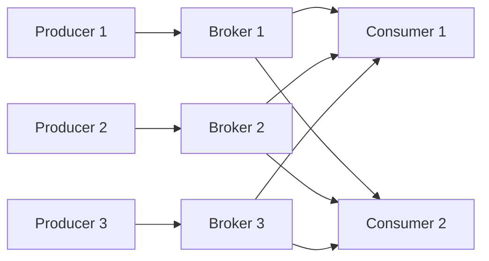

# Kafka 아키텍처와 핵심 개념

## 🏗️ Kafka란?

Apache Kafka는 LinkedIn에서 개발한 **분산 스트리밍 플랫폼**입니다. 
- 실시간 데이터 파이프라인 구축
- 높은 처리량과 낮은 지연시간
- 수평적 확장 가능한 아키텍처

## 📊 핵심 구성 요소

### 1. Topic (토픽)
```
메시지가 저장되는 논리적 카테고리
├── user-events
├── payment-transactions
└── system-logs
```

### 2. Partition (파티션)
```
Topic을 물리적으로 분할한 단위
Topic: user-events
├── Partition 0: [msg1, msg4, msg7...]
├── Partition 1: [msg2, msg5, msg8...]
└── Partition 2: [msg3, msg6, msg9...]
```

### 3. Offset (오프셋)
각 파티션 내에서 메시지의 고유 ID (순차적 증가)
```
Partition 0:
[0] → [1] → [2] → [3] → [4] → [5]
 ↑                           ↑
oldest                    latest
```

## 🔄 Kafka 동작 원리

### Producer → Broker → Consumer



## 🎯 주요 특징

### 1. 고가용성 (High Availability)
- **Replication Factor**: 데이터 복제본 수
- Leader/Follower 구조로 장애 대응

### 2. 순서 보장
- **파티션 내**: 순서 보장 ✅
- **파티션 간**: 순서 보장 ❌

### 3. 메시지 보존
- 시간 기반: `retention.ms`
- 크기 기반: `retention.bytes`

## 💻 Go로 Kafka 연동하기

### 설치
```bash
go get github.com/segmentio/kafka-go
```

### 기본 Producer 예제
```go
package main

import (
    "context"
    "fmt"
    "github.com/segmentio/kafka-go"
    "time"
)

func main() {
    // Kafka Writer 생성
    writer := kafka.NewWriter(kafka.WriterConfig{
        Brokers: []string{"localhost:9092"},
        Topic:   "user-events",
    })
    defer writer.Close()

    // 메시지 전송
    err := writer.WriteMessages(context.Background(),
        kafka.Message{
            Key:   []byte("user-123"),
            Value: []byte(`{"event": "login", "timestamp": "2024-01-01T10:00:00Z"}`),
        },
    )
    
    if err != nil {
        fmt.Printf("메시지 전송 실패: %v\n", err)
    } else {
        fmt.Println("메시지 전송 성공!")
    }
}
```

### 기본 Consumer 예제
```go
package main

import (
    "context"
    "fmt"
    "github.com/segmentio/kafka-go"
    "log"
)

func main() {
    // Kafka Reader 생성
    reader := kafka.NewReader(kafka.ReaderConfig{
        Brokers:   []string{"localhost:9092"},
        Topic:     "user-events",
        GroupID:   "user-analytics-group",
        Partition: 0,
        MinBytes:  10e3, // 10KB
        MaxBytes:  10e6, // 10MB
    })
    defer reader.Close()

    // 메시지 수신
    for {
        msg, err := reader.ReadMessage(context.Background())
        if err != nil {
            log.Printf("메시지 읽기 실패: %v", err)
            break
        }
        
        fmt.Printf("받은 메시지: %s = %s\n", 
            string(msg.Key), 
            string(msg.Value))
    }
}
```

## 🔍 Zookeeper vs KRaft

### Zookeeper 모드 (전통적)
- 메타데이터 관리를 위한 별도 서비스
- 클러스터 상태 관리
- 리더 선출

### KRaft 모드 (Kafka 2.8+)
- Zookeeper 의존성 제거
- Kafka 자체적으로 메타데이터 관리
- 더 간단한 운영과 높은 성능

## 📝 정리

Kafka의 핵심은 **분산**, **확장성**, **내구성**입니다:

1. **Topic/Partition**: 데이터 구조화와 병렬 처리
2. **Offset**: 메시지 위치 추적과 재처리
3. **Replication**: 데이터 안정성
4. **Consumer Group**: 부하 분산과 확장성

다음 단계에서는 Producer와 Consumer를 더 깊이 있게 다뤄보겠습니다!